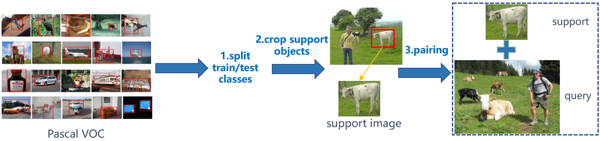

## Introduction
Pascal-OSCD is a dataset for one-shot conditional object detection, which is based on the Pascal VOC 2007 and 2012 datasets. We divide all 20 classes with a ratio of 4:1 so that there are 16 seen classes for training/validation and 4 unseen classes for test. Support images are cropped from object bounding
boxes and paired with query images that contain the same class objects randomly. Training image pairs are sampled from the train&val subsets of Pascal VOC 2007 and 2012 datasets, while the validation/test pairs are generated from the test subset of Pascal VOC 2007 dataset.  

The building process is shown below.

## Building dataset

Step 1. Download Pascal VOC 2007 and 2012 datasets from: http://host.robots.ox.ac.uk/pascal/VOC/

Step 2. Build this dataset by following the example given in generate_image_pairs.py.

## References
[Pascal VOC](http://host.robots.ox.ac.uk/pascal/VOC/)

