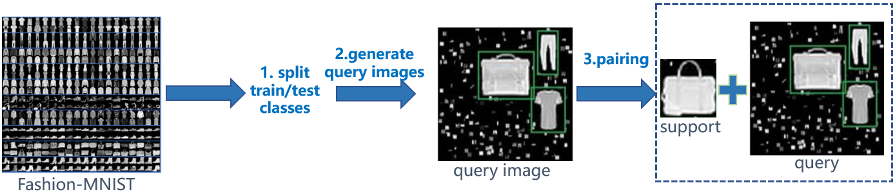

# OSCD-datasets
We build two benchmarks based on fashion-mnist and Pascal VOC to evaluate one-shot conditional object detection and provide convenience for the community.  

# 1. Fashion-OSCD

## 1.1 Introduction

Fashion-OSCD is a dataset for one-shot conditional object detection, which is constructed by randomly scaling and embedding samples of Fashion-MNIST dataset into a larger image.

We make each image contain as much as 3 objects with multiple scales and aspect ratios. 7 classes are randomly selected as seen classes for training/validation, the other 3 unseen classes for test. Overall, we generate 8000 training, 8000 validation and 6999 test images. 

The building process is shown below.

 

## 1.2 Download

This dataset can be downloaded from:

OneDrive: https://1drv.ms/u/s!AgYiu2IzGlVAiVYmyr0fN4PSUeYX?e=jKZgdm

BaiduNetdisk: https://pan.baidu.com/s/1Q1l9o4UFRYlAHvN-c-h-7Q  password: 0k3t 

The Fashion-MNIST dataset can be downloaded from  https://github.com/zalandoresearch/fashion-mnist#get-the-data

## 1.3 Building dataset

Generate image pairs by following the example given in ./Fashion-OSCD/generate_image_pairs.py.

## 1.4 References
[fashion-mnist](https://github.com/zalandoresearch/fashion-mnist)

# 2. Pascal-OSCD

## 2.1 Introduction

Pascal-OSCD is a dataset for one-shot conditional object detection, which is based on the Pascal VOC 2007 and 2012 datasets. We divide all 20 classes with a ratio of 4:1 so that there are 16 seen classes for training/validation and 4 unseen classes for test. Support images are cropped from object bounding
boxes and paired with query images that contain the same class objects randomly. Training image pairs are sampled from the train&val subsets of Pascal VOC 2007 and 2012 datasets, while the validation/test pairs are generated from the test subset of Pascal VOC 2007 dataset.  

The building process is shown below.


## 2.2 Building dataset

Step 1. Download Pascal VOC 2007 and 2012 datasets from: http://host.robots.ox.ac.uk/pascal/VOC/

Step 2. Build this dataset by following the example given in ./Pascal-OSCD/generate_image_pairs.py.

## 2.3 References

[Pascal VOC](http://host.robots.ox.ac.uk/pascal/VOC/)

## Citation
If you find **Fashion-OSCD** and **Pascal-OSCD** useful in your research, please consider citing:

```
@article{FU2020,
title = "OSCD: A one-shot conditional object detection framework",
journal = "Neurocomputing",
year = "2020",
issn = "0925-2312",
doi = "https://doi.org/10.1016/j.neucom.2020.04.092",
url = "http://www.sciencedirect.com/science/article/pii/S0925231220306779",
author = "Kun Fu and Tengfei Zhang and Yue Zhang and Xian Sun",
keywords = "One-shot, Object detection",
}

@ARTICLE{8735792,  
author={K. {Fu} and T. {Zhang} and Y. {Zhang} and M. {Yan} and Z. {Chang} and Z. {Zhang} and X. {Sun}},  
journal={IEEE Access},   
title={Meta-SSD: Towards Fast Adaptation for Few-Shot Object Detection With Meta-Learning},   
year={2019},  
volume={7},  
number={},  
pages={77597-77606},
}
```
